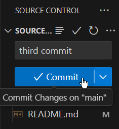
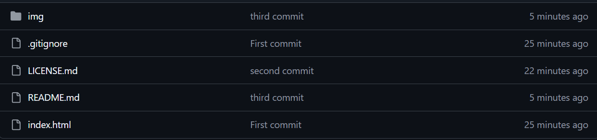
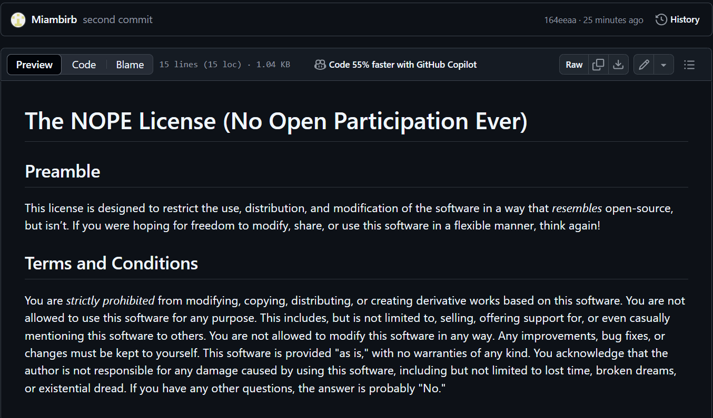

### Travail Pratique 2
Ce dépôt contient le code d’un projet web fait dans le cours de Perspective Professionnelles.
**Faire un commit et un push dans Visual Studio Code**
Voici comment faire un changement sur ce projet, et l’envoyer sur GitHub.
1. Example de premier commit
2. Example de main GitHub 
3. Example de resultat de code

 **Contributeurs**
 -[Jérémy Simms](https://github.com/Miambirb)[- Auteur Principal]
 **Licence**
 Copyright @ 2023 Votre Nom. Tous droits réservés.