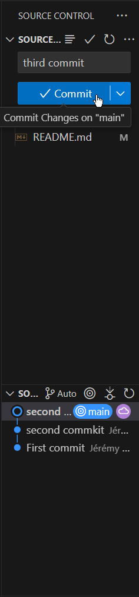

#### Travail Pratique 2
Ce dépôt contient le code d’un projet web fait dans le cours de Perspective Professionnelles.
**Faire un commit et un push dans Visual Studio Code**
Voici comment faire un changement sur ce projet, et l’envoyer sur GitHub.
1. Example de premier commit
2. Texte de l’étape 2
3. Texte de l’étape 3
4. Texte de l’étape 4
 
 **Contributeurs**
 